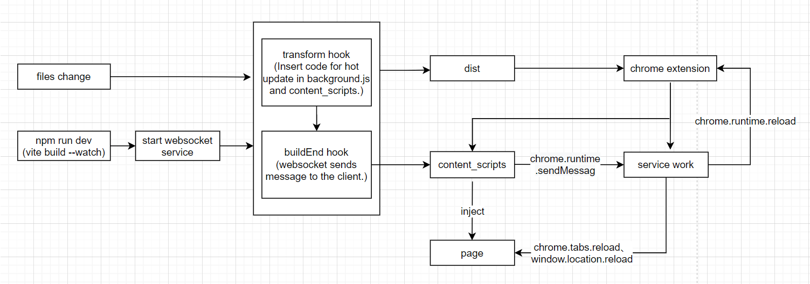

## Diagram



## Install

```bash
npm install vite-plugin-crx-hot-reload -D

# yarn
yarn add vite-plugin-crx-hot-reload -D

# pnpm
pnpm install vite-plugin-crx-hot-reload -D
```

## Usage

```js
import viteCrxHotReload from 'vite-plugin-crx-hot-reload'

export default {
  plugins: [viteCrxHotReload(/* plugin options */)]
}
```

## Plugin options

### port

- **Type:** `number`
- **Default:** `8181`

Establish a Socket Connection. Send a message to the Chrome extension client to update when a file changes.

### watch

- **Type:** `Object`

During the tranform hook phase, code to update the app is inserted into the background.js and content scripts.

**Example:**

```js
viteCrxHotReload({
  watch: {
    background: './src/js/background.js',
    content_scripts: [
      './src/js/content_scripts/content.js',
      './src/js/content_scripts/gitlab.js'
    ]
  }
})
```

### buildEnd

- **Type:** `Function`

A callback method for the completion of the first packaged build, in which you can do things like copy and move files.

**Example:**

```js
viteCrxHotReload({
  buildEnd() {
    //do something
  }
})
```
