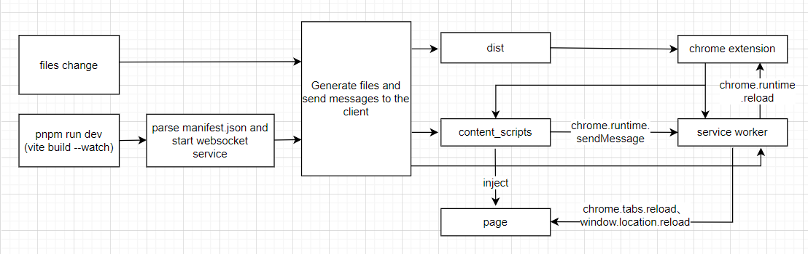

## Workflow



## Install

```bash
pnpm install vite-plugin-crx-hot-reload -D
```

## Usage

```js
import crxHotReload from 'vite-plugin-crx-hot-reload'

export default {
  plugins: [crxHotReload(/* plugin options */)]
}
```

## Plugin options

### port

- **Type:** `number`
- **Default:** `8181`

Establish a Socket Connection. Send a message to the Chrome extension client to update when a file changes.

### input

- **Type:** `string`
- **Required :** `true`

Manifest file for Chrome extension.

**Example:**

```js
crxHotReload({
  input: './src/manifest.json'
})
```

## Notes
+ Build.emptyOutDir needs to set `false` in vite configuration file.
+ After starting the project, if you find that the page does not refresh automatically after modifying content_scripts, you may need to refresh the page manually first.

